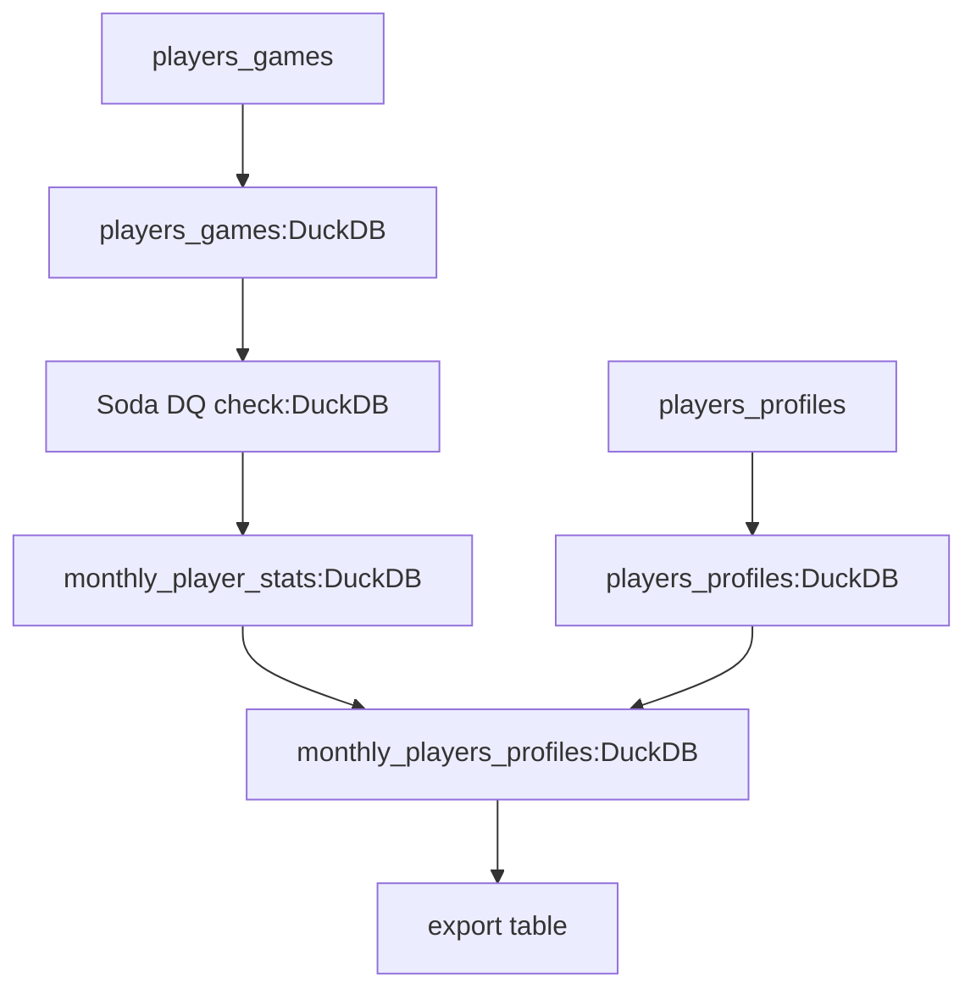
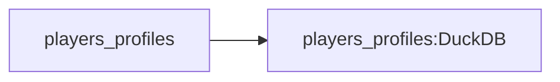

# Chess Data Analysis Tutorial (Advanced) - Part 1: Initial Setup and Data Load

In this advanced tutorial, we'll construct a data pipeline using Dagster ODP to analyze chess game data from chess.com. Our pipeline will leverage several powerful tools in the modern data stack:

- DLT for efficient data ingestion
- DuckDB for high-performance storage and processing
- DBT for SQL-based transformations on DuckDB
- Soda for comprehensive data quality checks

By the end of this tutorial, you'll have created a pipeline that calculates the number of games played by each of the top ten ranked players in the world on a monthly basis, starting from the beginning of 2022.

!!!tip "Prerequisites"
    This tutorial assumes familiarity with:
    
    - Dagster concepts including assets, asset checks, scheduling, and partitions
    - Basic understanding of DLT for data ingestion
    - Fundamentals of DBT for data transformations
    - Basic knowledge of Soda for data quality checks

    If you're new to any of these tools, we recommend exploring their documentation before proceeding.

Before diving into the pipeline construction, ensure you have Dagster ODP installed (refer to the [Quickstart Guide](../getting-started/quickstart.md) for installation instructions).

## Pipeline Overview

Let's examine the structure of the pipeline we're about to construct:


This diagram illustrates our planned pipeline:

1. **Player Profile Ingestion**
    * Fetches basic information about chess players (name, chess.com id) from chess.com's API
    * Stores this reference data in DuckDB for joining with game statistics
    * This is a one-time load since player profiles don't change frequently

2. **Monthly Game Data Ingestion**
    * Ingests detailed game data for each player on a monthly schedule
    * Each game record includes outcomes, accuracy scores, and timing information
    * Uses DuckDB for storage for local analytical queries
    * Implemented as a partitioned load to handle the large volume of data efficiently

3. **Data Quality**
    * Implements Soda checks to verify the integrity of ingested game data
    * Ensures data completeness and consistency before analysis
    * Blocks downstream processing if quality checks fail

4. **Analytics**
    * Uses DBT to run SQL queries on DuckDB for transformation of raw game data into player performance metrics
    * Calculates monthly statistics like win rates and accuracy scores
    * Joins game statistics with player profile information

5. **Results**
    * Exports the final analytics to CSV format

We'll construct this pipeline step by step, providing detailed explanations for each component along the way.

## Initial Project Setup

Before we dive into the data pipeline, let's set up our Dagster project with ODP:

1. Create a new Dagster project using the scaffold command:
  ```bash
  dagster project scaffold --name chess_analysis
  cd chess_analysis
  ```
  This command creates a basic Dagster project structure. We'll modify it to use Dagster ODP.

2. Create the necessary directories for our project:
  ```bash
  mkdir -p odp_config/workflows
  mkdir data
  ```
  The `odp_config` directory will contain our Dagster ODP configuration, the `workflows` subdirectory will hold our pipeline definitions, and the `data` directory will store both our output files and the DuckDB database file.

3. Update the `chess_analysis/definitions.py` file to use ODP:
  ```python
  from dagster_odp import build_definitions

  defs = build_definitions("odp_config")
  ```
  This tells Dagster ODP to use our configuration files in the `odp_config` directory to build the Dagster definitions. Dagster ODP will convert our YAML configurations into the corresponding Dagster components (assets, resources, and jobs).

Now that we have our project set up, let's move on to setting up DLT for data ingestion.

## Initial Data Load

In this step, we'll focus on loading player profiles into DuckDB using DLT. This is a one-time load that won't be scheduled. We'll be working on this portion of the pipeline:



### Setting Up DLT

ODP provides a custom DLT integration that offers several advantages over Dagster's built-in DLT integration:

1. **Automatic Source Asset Creation:** ODP automatically creates a source asset based on your asset key. For example, with an asset key of `chess_com/chess_data/players_games`, ODP creates a source asset named `chess_com/chess_data`. This makes dependency management more intuitive and reduces manual configuration.

2. **Granular Asset Creation:** While Dagster's DLT integration creates a single asset regardless of how many objects DLT creates, ODP creates separate Dagster assets for each DLT object. For instance, if a DLT API source creates tables for both games and moves, ODP will create distinct assets for each, allowing for:
    - More precise dependency management
    - Independent materialization of each object
    - Clearer lineage tracking

3. **Intelligent Metadata Handling:** ODP automatically captures materialization metadata (like table names or file paths) and makes it available to child assets through variables in the configuration. This creates a clean communication channel between assets without requiring custom code.

Let's set up our DLT project to take advantage of these features:

1. Install DLT by following the [official installation guide](https://dlthub.com/docs/reference/installation).

2. Initialize a new DLT project for chess data:
  ```bash
  mkdir chess_dlt
  cd chess_dlt
  dlt init chess duckdb
  ```
  This creates a DLT project with the basic code needed to interact with the chess.com API and store data in DuckDB.

3. For ODP's DLT integration to work, we need to generate a schema file that describes the objects DLT will create. ODP uses this schema file to determine which Dagster assets to create, name the assets and set up the correct dependencies.

    1. Replace `chess_dlt/chess_pipeline.py` with the following code to create a schema-generating pipeline:
    ```python hl_lines="11"
    import dlt
    from chess import source

    def load_players_games_example(start_month: str, end_month: str) -> None:
        """Constructs a pipeline that will load chess games of specific players for a range of months."""
        # configure the pipeline: provide the destination and dataset name to which the data should go
        pipeline = dlt.pipeline(
            pipeline_name="chess_pipeline",
            destination="duckdb",
            dataset_name="chess_players_games_data",
            export_schema_path="schemas/export",
        )
        # create the data source by providing a list of players and start/end month in YYYY/MM format
        data = source(
            ["magnuscarlsen", "vincentkeymer", "dommarajugukesh", "rpragchess"],
            start_month=start_month,
            end_month=end_month,
        )
        # load the "players_games" and "players_profiles" out of all the possible resources
        info = pipeline.run(data.with_resources("players_games", "players_profiles"))
        print(info)

    if __name__ == "__main__":
        # run our main example
        load_players_games_example("2022/11", "2022/12")
    ```
    This code will create the schema file for the DLT resources we will be using.

    2. Execute the pipeline:
    ```bash
    python chess_pipeline.py
    ```
  The schema yaml file is created in the `schemas/export` directory, which we will pass on to ODP through the workflow config.

### Configuring ODP

With DLT set up, we need to tell ODP how to use it. ODP needs two main pieces of configuration:

- **Resource configuration**: Tells ODP where to find our DLT project
- **Workflow configuration**: Defines what data to fetch and how to process it

Let's create these configurations:

First, create `dagster_config.yaml` to define our DLT resource:
```yaml title="dagster_config.yaml"
resources:
  - resource_kind: dlt
    params:
      project_dir: chess_dlt
```
This configuration tells ODP where to find our DLT project. The `project_dir` parameter points to the DLT project we just created, allowing ODP to access the DLT source code and schema information.

Now, let's define our initial data load workflow. Create `initial_load.yaml` in `odp_config/workflows`:
```yaml title="initial_load.yaml"
assets:
  - asset_key: chess_com/chess_data/players_profiles
    task_type: dlt
    description: chess.com players profiles
    group_name: ingestion
    params:
      source_module: chess.source
      schema_file_path: schemas/export/chess.schema.yaml
      source_params:
        players:
          - magnuscarlsen
          - hikaru
          - ghandeevam2003
          - fabianocaruana
          - gukeshdommaraju
          - chesswarrior7197
          - firouzja2003
          - lovevae
          - lachesisq
          - thevish
      destination: duckdb
      destination_params:
        credentials: data/chess.db
      pipeline_params:
        dataset_name: chess_games
      run_params:
        write_disposition: replace
```
This YAML file defines our asset. Let's break down the key components:

* `asset_key`: Uniquely identifies this asset. In ODP, the asset key determines what source assets and DLT-produced assets will be created. Following our naming structure `chess_com/chess_data/players_profiles`:
    - `players_profiles` specifies which DLT resource (API endpoint) to use
    - `chess_com/chess_data` becomes the source asset name
* `task_type`: Specifies that we're using DLT for this task.
* `group_name`: Groups this asset under "ingestion" for organizational purposes.
* `params`: Contains all the configuration needed for the DLT pipeline:
    - `source_module`: Path to the DLT source function in your DLT project. Since our code is in `chess_dlt/chess/__init__.py`, we use `chess.source`
    - `schema_file_path`: Path to the schema file we generated earlier. ODP uses this to understand what objects DLT will create and set up the corresponding Dagster assets
    - `source_params`: Parameters passed directly to the DLT source function - in our case, the list of chess players to fetch data for
    - `destination`: A valid DLT destination
    - `destination_params`: Parameters passed to the destination function - here we're providing the path to our DuckDB database
    - `pipeline_params`: Parameters passed to DLT's pipeline
    - `run_params`: Parameters passed to DLT's run method. Here we use `replace` to overwrite any existing data in this initial load

When this asset is materialized, ODP will:

1. Create a source asset `chess_com/chess_data` 
2. Use the DLT integration to fetch player profile data
3. Store the data in our DuckDB database
4. Make all materialization metadata (like table names) available to downstream assets

Launch the Dagster development server from the Dagster project directory and materialize the asset:
  ```bash
  dagster dev
  ```
In the Dagster UI, navigate to the `chess_com/chess_data/players_profiles` asset and initiate materialization. This executes the pipeline we have built so far, pulling player profile data from chess.com and storing it in our DuckDB database.

## Conclusion

In this first part of our tutorial, we've set up our Dagster ODP project and implemented the initial data load for player profiles. We've seen how ODP simplifies the process of integrating DLT with Dagster, allowing us to define complex data ingestion tasks using simple YAML configuration.

In the next part, we'll expand our pipeline to include monthly game data loads, implement data quality checks using Soda, and start building our analysis pipeline using DBT. We'll see how ODP's integrations with these tools allow us to create a robust, maintainable data pipeline with minimal code.
