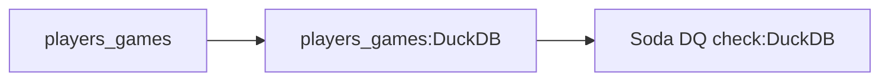

# Chess Data Analysis Tutorial (Advanced) - Part 2: Monthly Data Load and Quality Checks

In this section of our tutorial, we'll focus on setting up a monthly load for player games data and implementing data quality checks. We'll be working with this portion of our pipeline:



We'll configure a partitioned asset for player games data, set up a monthly scheduled job to keep our dataset up-to-date, and implement Soda checks to ensure data quality.

## Configure the Monthly Load Asset

Let's create a new workflow file for our monthly load. Create a file named `monthly_load.yaml` in the `odp_config/workflows` directory with the following content:

```yaml title="monthly_load.yaml"
assets:
  - asset_key: chess_com/chess_data/players_games
    task_type: dlt
    description: chess.com players games
    group_name: data_ingestion
    params:
      source_module: chess.source
      schema_file_path: schemas/export/chess.schema.yaml
      source_params:
        players:
          - magnuscarlsen
          - hikaru
          - ghandeevam2003
          - fabianocaruana
          - gukeshdommaraju
          - chesswarrior7197
          - firouzja2003
          - lovevae
          - lachesisq
          - thevish
        start_month: "{{#date}}{{context.partition_key}}|%Y/%m{{/date}}"
        end_month: "{{#date}}{{context.partition_key}}|%Y/%m{{/date}}"
      destination: duckdb
      destination_params:
        credentials: data/chess.db
      pipeline_params:
        dataset_name: chess_games
      run_params:
        write_disposition: append

partitions:
  - assets: ["chess_com/chess_data/players_games"]
    params:
      start: "2022-01-01"
      schedule_type: MONTHLY

jobs:
  - job_id: monthly_chess_data_ingestion
    triggers:
      - trigger_id: monthly_chess_data_schedule
        trigger_type: schedule
        description: Fetch chess games every month
        params:
          schedule_kind: partition
    asset_selection:
      - chess_com/chess_data/players_games*
```
Let's examine each component of our configuration in detail, focusing on the new elements we're introducing:

#### Variables and Date Formatting
```yaml
start_month: "{{#date}}{{context.partition_key}}|%Y/%m{{/date}}"
end_month: "{{#date}}{{context.partition_key}}|%Y/%m{{/date}}"
```
This configuration demonstrates two powerful ODP features:

1. **Context Variables**: The `{{context.partition_key}}` variable gives us access to the current partition being processed. For monthly partitions, this will be a date string like "2022-01-01".

2. **Date Transformations**: The `{{#date}}...{{/date}}` syntax allows us to transform dates into specific formats:
    - Everything before the `|` is the date string to format
    - Everything after the `|` is the desired format (using standard Python datetime format codes)
    - In this case, we're converting "2022-01-01" to "2022/01" as required by the chess.com API

#### Partition Configuration
The partition section defines time-based partitioning for our assets:

1. **Assets List**: Lists which assets should use this partitioning scheme. Multiple assets can share the same partition configuration, ensuring they process the same time windows.

2. **Partition Parameters**:
    - `start`: When to begin partitioning (January 1st, 2022 in our case)
    - `schedule_type`: How to divide the time (MONTHLY creates one partition per month)

    ODP automatically creates partitions from the start date up to the current date. Each partition represents one month of data.

#### Job Configuration
The job configuration ties everything together:

1. **Job Definition**:
    - `job_id`: A unique identifier for this job
    - `description`: Human-readable explanation of the job's purpose

2. **Trigger Configuration**:
    - `trigger_id`: Unique identifier for this trigger
    - `trigger_type`: Set to "schedule" for time-based execution
    - `schedule_kind`: Set to "partition" to use our partition definition. Dagster automatically triggers runs using the partition schedule of the assets in the job.

3. **Asset Selection**:
    - The asterisk (*) in `chess_com/chess_data/players_games*` selects both the asset and any downstream assets
    - This ensures that when a partition runs, it processes both the data ingestion and any dependent transformations

## Implementing a Soda Asset Check

A data quality check catches potential issues early in our pipeline, preventing downstream problems that could arise from bad data. ODP integrates with Soda, allowing users to define data quality rules through Dagster asset checks without writing code. Let's implement a Soda asset check:

1. Create directories for Soda configuration:
  ```bash
  mkdir -p odp_config/soda/scans
  ```
  Soda requires a specific directory structure for its configuration files. The `soda` directory will contain the main Soda configuration, while the `scans` subdirectory will house individual check files for different assets.

2. Add the Soda resource to `dagster_config.yaml`:
  ```yaml title="dagster_config.yaml" hl_lines="6-9"
  resources:
    - resource_kind: dlt
      params:
        project_dir: chess_dlt
    
    - resource_kind: soda
      params:
        project_dir: odp_config/soda
        checks_dir: scans
  ```
  We're adding a Soda resource here, specifying the directory for Soda configuration files and the subdirectory for individual check files. ODP will use this information to set up the Soda integration and locate the appropriate check files for each asset.

3. Create a `configuration.yml` file in the `odp_config/soda` directory:
  ```yaml title="configuration.yml"
  data_source chess_duckdb:
    type: duckdb
    path: data/chess.db
  ```
  This file tells Soda how to connect to our DuckDB database.

4. Create a check file `players_games_check.yml` in the `odp_config/soda/scans` directory:
  ```yaml title="players_games_check.yml"
  checks for chess_games.players_games:
    # Missing value checks
    - missing_count(white__aid) = 0:
        name: No missing values in white__aid
    - missing_count(black__aid) = 0:
        name: No missing values in black__aid
    - missing_count(white__result) = 0:
        name: No missing values in white__result
    - missing_count(black__result) = 0:
        name: No missing values in black__result

    # Basic count check
    - row_count > 0:
        name: Ensure players_games table is not empty
    
    # Duplicate check
    - duplicate_count(uuid):
        name: No duplicate rows
        warn: when > 0
  ```
  Let's break down the Soda check configuration:
    - We ensure that critical fields we use in our analysis are not missing.
    - We also make sure that the table is not empty after each load.
    - A warning-level check for duplicate game IDs helps track potential duplicates without blocking the pipeline.

5. Add the Soda check to the `monthly_load.yaml` workflow file:
  ```yaml title="monthly_load.yaml"
  soda_checks:
    - asset_key: chess_com/chess_data/players_games
      check_file_path: players_games_check.yml
      blocking: true
      description: Basic DQ checks for players games
      data_source: chess_duckdb
  ```
  This section defines a Dagster asset check as part of the workflow. Let's break down the key components:
    * `asset_key`: Specifies which asset this check applies to.
    * `check_file_path`: Points to the Soda check file we created earlier.
    * `blocking`: When set to true, downstream assets won't process if these checks fail.
    * `data_source`: Refers to the Soda data source we defined in configuration.yml.
  ODP will create a Dagster asset check based on this configuration, which will run the specified Soda checks whenever the asset is materialized.

## Running the Monthly Load and Checks

Now that we've set up our monthly load configuration and Soda checks, let's run it:

1. Start the Dagster development server if it's not already running. If it is, reload the definitions in the UI.

2. Navigate to the "Jobs" tab in the top navigation.

3. Find the `monthly_chess_data_ingestion` job, and and click on it.

4. Click the "Materialize" button in the top right corner.

5. In the partition selection dialog, you can choose which partition (month) you want to process.

    !!!danger "Running multiple partitions"
        When running multiple partitions, it's recommended to process them one at a time or limit concurrency. Running a backfill of multiple partitions without [limiting concurrency](https://docs.dagster.io/guides/limiting-concurrency-in-data-pipelines#limiting-concurrency-in-data-pipelines) might cause DuckDB concurrency issues.

        You can handle this in one of two ways:

        1. Configure concurrency limits in your Dagster instance config file (`~/.dagster/dagster.yaml`):
          ```yaml
          run_queue:
            tag_concurrency_limits:
              - key: "dagster/backfill"
                limit: 1
          ```
          This setting limits all backfills to one run at a time.

        2. Or, select and run partitions one at a time manually through the UI.

6. Click "Launch backfill" to start the job.

Dagster will now process the selected partition, fetching the chess game data for that month, storing it in your DuckDB database, and running the Soda checks on the ingested data. 

!!! info "Duplicate rows in `players_check_games`"
    When the job runs, you'll see the results of our Soda checks. While most checks should pass, you might see a warning for `duplicate_count(uuid)`. This is expected - the chess.com API sometimes returns the same game multiple times in their data. Don't worry about this warning - in Part 3 of this tutorial, we'll handle these duplicates in our SQL transformations when we calculate player statistics.

## Conclusion

In this part of the tutorial, we've set up a partitioned asset for monthly game data, configured a job to run this asset on a schedule, and implemented data quality checks using Soda. This approach allows us to efficiently manage and update our chess game dataset over time while ensuring data quality. In the next part of this tutorial, we'll use DBT and SQL to transform our raw game data into meaningful analytics.
