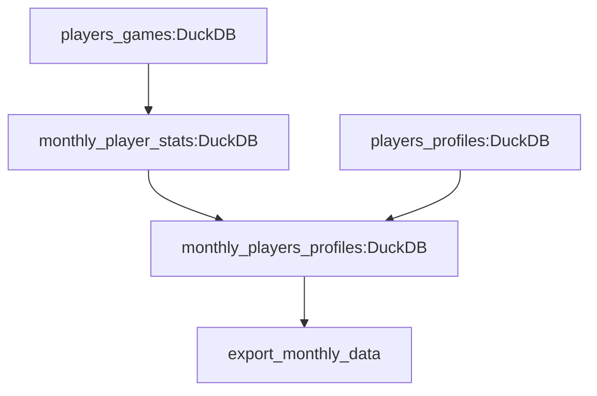

# Chess Data Analysis Tutorial (Advanced) - Part 3: Data Transformations with DBT

In this final part of our tutorial, we'll implement the analytical layer of our pipeline using DBT and export the results. We'll be working with this portion of our pipeline:



We'll create DBT models to:

1. Calculate monthly statistics for each player's games
2. Join this with player profile information
3. Export the final results to a CSV file

## Understanding ODP's DBT Integration

ODP's integration with DBT is designed to be both simple and flexible. Here's how it works:

### Basic DBT Integration

The simplest way to use DBT with ODP is to just define a DBT resource in your `dagster_config.yaml`. Dagster will:

- Automatically discover all DBT models in your project
- Create corresponding Dagster assets for each model
- Set up the correct dependencies between models based on DBT's `ref()` and `source()` functions
- Make these assets available for materialization in Dagster

### When to Define DBT Tasks

While the basic integration works well for simple cases, there are times when you'll want to explicitly define a DBT task in your workflow files:

1. **Variable Passing**: When you need to pass variables to your DBT models (like a target date or filtering criteria)
2. **Partitioning**: When the model needs to be included in a partition configuration for incremental processing
3. **Custom Scheduling**: When you need specific scheduling or triggering logic for the model

In our tutorial, we define a DBT task for `monthly_player_stats` and include it in our partitioning because:

- It needs the `target_month` variable from our partition key
- It uses incremental processing based on that partition

For `monthly_player_profiles`, we let ODP automatically create the asset since it doesn't require any special handling.

## Setting Up DBT

Let's start with the DBT setup:

1. In the `chess_analysis` directory, initialize DBT:
  ```bash
  dbt init chess_dbt
  ```
  Choose `duckdb` as your database.

2. Create a `profiles.yml` file in the `chess_dbt` directory:
    ```yaml title="profiles.yml"
    chess_dbt:
      outputs:
        dev:
          path: /Users/your_username/chess_analysis/data/chess.db
          type: duckdb
    ```

    !!!warning "Important"
        Replace `/Users/your_username/chess_analysis/data/chess.db` with the full absolute path to your DuckDB database file. DBT requires a full path here - relative paths won't work.

    !!!tip "Profile Selection"
        The `profile` and `target` specified in your DBT resource configuration must match your profiles.yml. In this case, we're using profile `chess_dbt` and target `dev`.

3. Add the DBT and DuckDB resources to `odp_config/dagster_config.yaml`:
  ```yaml title="dagster_config.yaml"
  resources:
    - resource_kind: dlt
      params:
        project_dir: chess_dlt

    - resource_kind: soda
      params:
        project_dir: odp_config/soda
        checks_dir: scans

    - resource_kind: dbt
      params:
        project_dir: chess_dbt     # Path to your DBT project
        profile: chess_dbt         # Must match profiles.yml
        target: dev               # Target from profiles.yml

    - resource_kind: duckdb
      params:
        database_path: data/chess.db  # Needed for the export task
  ```
    The DBT resource parameters explained:
    * `project_dir`: Location of your DBT project relative to where Dagster runs
    * `profile`: Name of the DBT profile to use (must match profiles.yml)
    * `target`: The specific target within the profile (e.g., dev, prod)

## Configuring DBT Sources

Create `models/sources.yml` to tell DBT about our source tables:

First, let's clean up the default DBT models:

```bash
rm -rf chess_dbt/models/example/  # Remove the default example models
```

Now create `models/sources.yml` to tell DBT about our source tables:
```yaml title="sources.yml"
version: 2
sources:
  - name: chess_data
    schema: chess_games
    tables:
      - name: players_games
        meta:
          dagster:
            asset_key: ["chess_com", "chess_data", "players_games"] 
      - name: players_profiles
        meta:
          dagster:
            asset_key: ["chess_com", "chess_data", "players_profiles"]
```
The `meta.dagster.asset_key` is crucial here - it tells Dagster which assets correspond to which DBT sources. This enables:

* Automatic dependency management
* Asset lineage tracking
* Triggering DBT models

## Creating DBT Models

We'll create two DBT models: one for calculating monthly statistics and another for combining those stats with player information.

### Monthly player stats

First, create `models/monthly_player_stats.sql`:
```sql title="monthly_player_stats.sql"
{{ config(
    materialized='incremental',
    unique_key=['player_id', 'game_month'],
    meta={'dagster': {'group': 'data_transformation'}}
) }}



WITH deduped_games AS (
    SELECT DISTINCT
        uuid,
        white__aid,
        black__aid,
        end_time,
        white__result,
        black__result,
        accuracies__white,
        accuracies__black
    FROM {{ source('chess_data', 'players_games') }}
),

player_games AS (
    SELECT
        white__aid AS player_id,
        DATE_TRUNC('month', CAST(end_time AS DATE)) AS game_month,
        uuid AS game_id,
        'white' AS color,
        white__result AS result,
        CAST(accuracies__white AS FLOAT) AS accuracy
    FROM deduped_games
    
    UNION ALL
    
    SELECT
        black__aid AS player_id,
        DATE_TRUNC('month', CAST(end_time AS DATE)) AS game_month,
        uuid AS game_id,
        'black' AS color,
        black__result AS result,
        CAST(accuracies__black AS FLOAT) AS accuracy
    FROM deduped_games
)

SELECT
    player_id,
    game_month,
    COUNT(DISTINCT game_id) AS total_games,
    SUM(CASE WHEN result = 'win' THEN 1 ELSE 0 END) AS total_wins,
    ROUND(AVG(CASE WHEN result = 'win' THEN 1 ELSE 0 END) * 100, 2) AS win_percentage,
    ROUND(AVG(CASE WHEN color = 'white' THEN accuracy ELSE NULL END), 2) AS avg_white_accuracy,
    ROUND(AVG(CASE WHEN color = 'black' THEN accuracy ELSE NULL END), 2) AS avg_black_accuracy
FROM player_games

WHERE DATE_TRUNC('month', CAST(end_time AS DATE)) = DATE '{{ target_month }}'

GROUP BY 1, 2
```

Let's examine the key components of this model:

1. **Model Configuration**
    - We use `materialized='incremental'` to make this an incremental model, processing only new data each run
    - The `group` in the metadata specifies which Dagster group this DBT model should belong to
    - The `target_month` variable from our partition key controls which data to process

2. **Incremental Processing Strategy**
    - The `WHERE` clause in the incremental model ensures we only process games from the current partition
    - This approach is particularly efficient when running on cloud data warehouses like BigQuery or Snowflake, as it minimizes the amount of data processed and costs
    - Each partition's results are appended to the table, building up our historical analysis over time

3. **Handling Duplicate Games**
    - Remember in Part 2, our Soda check warned us about duplicate game records
    - The `deduped_games` CTE uses `SELECT DISTINCT` on the `uuid` field to ensure each game is counted only once
    - We handle this at the transformation layer rather than ingestion to preserve the raw data as received from the API

4. **Data Transformation**
    - We use a `UNION ALL` to combine games where the player played as white or black
    - We calculate various statistics including total games, wins, win percentage, and average accuracy

### Monthly player profiles

We then create `models/monthly_player_profiles.sql`:
```sql title="monthly_player_profiles.sql"
{{ config(
    materialized='table', 
    meta={'dagster': {'group': 'data_transformation'}} 
) }}

WITH player_profiles AS (
    SELECT
        aid AS player_id,
        name,
        country,
        title,
        followers
    FROM {{ source('chess_data', 'players_profiles') }}
)

SELECT
    pp.player_id,
    pp.name AS player_name,
    pp.country,
    pp.title,
    pp.followers,
    mps.game_month,
    mps.total_games,
    mps.total_wins,
    mps.win_percentage,
    mps.avg_white_accuracy,
    mps.avg_black_accuracy
FROM {{ ref('monthly_player_stats') }} mps
JOIN player_profiles pp ON mps.player_id = pp.player_id
ORDER BY pp.player_id, mps.game_month
```

This model:

- Joins our monthly statistics with player profile information
- Is materialized as a table since it's our final output
- Includes both player attributes and their monthly performance metrics

## Configuring ODP for DBT Integration

Let's update our `monthly_load.yaml` to include DBT transformations:

```yaml title="monthly_load.yaml" hl_lines="31-48"
assets:
  - asset_key: chess_com/chess_data/players_games
    task_type: dlt
    description: chess.com source
    group_name: data_ingestion
    params:
      source_module: chess.source
      schema_file_path: schemas/export/chess.schema.yaml
      source_params:
        players:
          - magnuscarlsen
          - hikaru
          - ghandeevam2003
          - fabianocaruana
          - gukeshdommaraju
          - chesswarrior7197
          - firouzja2003
          - lovevae
          - lachesisq
          - thevish
        start_month: "{{#date}}{{context.partition_key}}|%Y/%m{{/date}}"
        end_month: "{{#date}}{{context.partition_key}}|%Y/%m{{/date}}"
      destination: duckdb
      destination_params:
        credentials: data/chess.db
      pipeline_params:
        dataset_name: chess_games
      run_params:
        write_disposition: append
      
  - asset_key: players_games_analysis
    task_type: dbt
    params:
      selection: monthly_player_stats
      dbt_vars:
        target_month: '{{context.partition_key}}'

  - asset_key: player_profiles_export
    task_type: duckdb_table_to_file
    description: "Export player data to csv"
    group_name: data_export
    depends_on: [monthly_player_profiles]
    params:
      source_table_id: monthly_player_profiles
      destination_file_uri: data/monthly_player_profiles.csv

partitions:
  - assets: ["chess_com/chess_data/players_games", "players_games_analysis"]
    params:
      start: "2022-01-01"
      schedule_type: MONTHLY
```
Let's break down the DBT-specific configurations:

### DBT Task Configuration
```yaml
- asset_key: players_games_analysis
  task_type: dbt
  params:
    selection: monthly_player_stats
    dbt_vars:
      target_month: '{{context.partition_key}}'
```

- `task_type`: Tells ODP this is a DBT task
- `selection`: Specifies which DBT model(s) to run. This field supports the DBT selection syntax that can include one or many model names, tags or paths.
- `dbt_vars`: Variables passed to your DBT models. These are accessible in DBT using `var()`

### Auto-created vs. Explicit Assets

Notice that we:

1. Explicitly defined `players_games_analysis` for `monthly_player_stats`
2. Referenced `monthly_player_profiles` only in dependencies

This is because:

- `monthly_player_stats` needs partition information and variables
- `monthly_player_profiles` works fine with Dagster's automatic asset creation

### Environment Setup

Create a `.env` file in your project directory (`chess_analysis`):
```bash
DAGSTER_DBT_PARSE_PROJECT_ON_LOAD=1
```
This tells Dagster ODP to parse your DBT project when loading and create the manifest.json file dynamically, keeping DBT assets up-to-date with your models.

## Running the Complete Pipeline

Now we can run our complete pipeline:

1. Start the Dagster development server:
    ```bash
    dagster dev
    ```

    !!!error "JSONDecodeError"
        If you encounter a `JSONDecodeError`, that's a [known issue](https://github.com/dagster-io/dagster/issues/23573). Re-running the server should fix the problem.

2. Navigate to the Jobs page in the UI and find the `monthly_chess_data_ingestion` job.

3. Launch a new run, selecting the partition you want to process.

4. After the job completes, you can find your results in `data/monthly_player_profiles.csv`.

The complete pipeline in the Dagster UI will look like this:


## Examining the Results

The final CSV file will contain rich analytics about each player's monthly performance:

- Basic player information (name, country, title)
- Total games played each month
- Win/loss statistics
- Average accuracy with white and black pieces

## Conclusion

In this tutorial series, we've built a complete data pipeline using Dagster ODP that:

- Ingests data from an external API using DLT
- Implements data quality checks with Soda
- Transforms data using DBT
- Manages incremental processing and partitioned loads
- Exports results for analysis

Key advantages of using ODP for this pipeline include:

- Configuration-driven development requiring minimal code
- Built-in integrations with modern data tools
- Automatic handling of dependencies between components
- Easy scheduling and partitioning of data loads
- Robust data quality checking

This pipeline can serve as a template for similar data processing needs, whether you're working with chess data or any other domain requiring regular data ingestion, transformation, and quality control.
