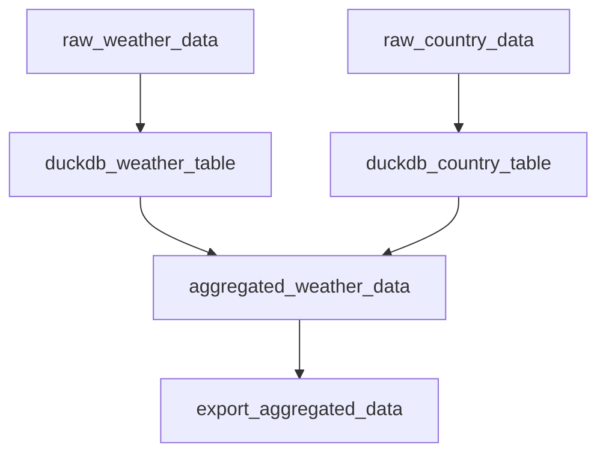

# Weather Analysis Tutorial

In this tutorial, we'll build a data pipeline using Dagster ODP to analyze weather data across different countries. Before we dive into the details, let's take a look at the pipeline we're going to build:


This diagram shows the flow of data through our pipeline:

1. We start by downloading raw weather and country data from Google Cloud Storage (GCS).
2. We then load this data into DuckDB tables. DuckDB is an embedded database, similar to SQLite, but optimized for analytical queries. It's a great choice for this pipeline because it's fast, requires no separate server setup, and works well with the kinds of aggregations we'll be doing.
3. Next, we join and aggregate the data using SQL queries within DuckDB.
4. Finally, we export the aggregated results to a Parquet file.

By the end of this tutorial, you'll understand how to construct a Dagster ODP pipeline and be familiar with its key concepts.

## Prerequisites

- Dagster ODP installed (see [Quickstart Guide](../getting-started/quickstart.md))
- Basic familiarity with Dagster concepts

## Step 1: Set Up the Project

Let's create a new Dagster project using the scaffold command:

```bash
dagster project scaffold --name weather_analysis
cd weather_analysis
```

This command creates a basic Dagster project structure. We'll modify it to use Dagster ODP.

## Step 2: Configure Dagster ODP Resources

Create a new directory called `odp_config` in the project root:

```bash
mkdir odp_config
```

Now, let's set up the Dagster configuration. Create a file `odp_config/dagster_config.yaml`:

```yaml title="dagster_config.yaml"
resources:
  - resource_kind: duckdb
    params:
      database_path: data/weather_analysis.db
```

This configuration defines the resources that Dagster ODP will create for our pipeline. In Dagster ODP, we define resources in the `dagster_config` file. This is different from standard Dagster, where resources are typically defined in Python code. This approach allows for easier configuration management and separates resource definitions from business logic.

Here's what this resource configuration does:

1. It specifies a `duckdb` resource, which is a pre-built ODP resource.
2. The `database_path` parameter tells DuckDB where to store the persistent database file.

Dagster ODP will convert this configuration into a Dagster resource that our assets can use.

## Step 3: Create the Workflow Configuration

Now, let's create our workflow configuration. Create a file `odp_config/weather_pipeline.yaml`:

```yaml title="weather_pipeline.yaml"
assets:
  - asset_key: raw_weather_data
    task_type: gcs_file_download
    description: "Download weather data from GCS"
    group_name: data_ingestion
    params:
      source_file_uri: gs://odp-weather-pipeline/weather_by_day/fct_country_daily_weather.csv
      destination_file_path: ./data/weather_data.csv

  - asset_key: raw_country_data
    task_type: gcs_file_download
    description: "Download country data from GCS"
    group_name: data_ingestion
    params:
      source_file_uri: gs://odp-weather-pipeline/weather-data/country_code_data/country_code_name_map.ndjson
      destination_file_path: ./data/country_data.ndjson

  - asset_key: duckdb_weather_table
    task_type: file_to_duckdb
    description: "Load weather data into DuckDB"
    group_name: data_loading
    depends_on: [raw_weather_data]
    params:
      source_file_uri: ./data/weather_data.csv
      destination_table_id: weather_data

  - asset_key: duckdb_country_table
    task_type: file_to_duckdb
    description: "Load country data into DuckDB"
    group_name: data_loading
    depends_on: [raw_country_data, duckdb_weather_table]
    params:
      source_file_uri: ./data/country_data.ndjson
      destination_table_id: country_data

  - asset_key: aggregated_weather_data
    task_type: duckdb_query
    description: "Aggregate weather data by country"
    group_name: data_transformation
    depends_on: [duckdb_weather_table, duckdb_country_table]
    params:
      query_file: odp_config/aggregate_weather.sql

  - asset_key: export_aggregated_data
    task_type: duckdb_table_to_file
    description: "Export aggregated data to Parquet"
    group_name: data_export
    depends_on: [aggregated_weather_data]
    params:
      source_table_id: aggregated_weather_data
      destination_file_uri: ./data/aggregated_weather_data.parquet

jobs:
  - job_id: weather_analysis
    asset_selection: [export_aggregated_data]
```

Let's break down this configuration, looking at both the pipeline logic and the Dagster ODP concepts:

1. **Assets and Tasks**: In Dagster ODP, assets are defined using tasks. A task represents an action and produces Dagster assets. Each asset in this file corresponds to a Dagster asset, and the `task_type` field specifies which pre-built ODP task to use.

2. **Pipeline Logic**:

    * **Data Ingestion**: The first two assets, `raw_weather_data` and `raw_country_data`, use the `gcs_file_download` task to fetch our raw data from Google Cloud Storage. This allows us to start with data stored in the cloud and bring it locally for processing.
    * **Data Loading**: Next, we load the downloaded files into DuckDB tables using the `file_to_duckdb` task. This prepares our data for efficient querying and aggregation.
    * **Data Transformation**: The `aggregated_weather_data` asset uses a SQL query (which we'll define next) to join and aggregate our data within DuckDB.
    * **Data Export**: Finally, we export our results to a Parquet file using the `duckdb_table_to_file` task.

3. **Group Name and Description**: The `group_name` and `description` fields are standard Dagster concepts that ODP passes through to the Dagster asset definitions. They help organize and document your assets.

4. **Dependencies**: The `depends_on` field defines dependencies between assets. These dependencies are passed directly into the Dagster asset definitions, ensuring that assets are materialized in the correct order.

5. **Jobs**: The `jobs` section defines a Dagster job. ODP converts this into a Dagster job definition, simplifying the process of creating jobs. Here, we define a single job that includes all of our assets.

This configuration creates a pipeline that downloads weather and country data, loads it into DuckDB, performs aggregations, and exports the results - all without writing any Python code for the pipeline itself.

## Step 4: Create the SQL Query

Create a file `odp_config/aggregate_weather.sql` with the following content:

```sql title="aggregate_weather.sql"
SELECT 
    c.country_name,
    AVG(w.avg_temp_celsius) as avg_temperature,
    AVG(w.precipitation_mm) as avg_precipitation,
    MIN(w.obs_date) as first_observation,
    MAX(w.obs_date) as last_observation,
    COUNT(DISTINCT w.obs_date) as observation_count
FROM weather_data w
JOIN country_data c ON w.country_id = c.country_id
GROUP BY c.country_name
HAVING observation_count > 365
ORDER BY avg_temperature DESC
```

This query joins our weather and country data and calculates various aggregations.

## Step 5: Update the Dagster Definitions

Replace the contents of `weather_analysis/__init__.py` with:

```python
from dagster_odp import build_definitions

defs = build_definitions("odp_config")
```

This tells Dagster ODP to use our configuration files in the `odp_config` directory to build the dagster definitions. Dagster ODP will convert our YAML configurations into the corresponding Dagster components (assets, resources, and jobs).

## Step 6: Run the Pipeline

Now you can run the pipeline using the Dagster CLI:

```bash
dagster dev
```

Open your browser and navigate to `http://localhost:3000`. You should see your Dagster instance with the `weather_analysis` job.

Click on "Materialize All" for the `export_aggregated_data` asset to run the entire pipeline.

As you run the pipeline, you might encounter some common issues. Here's how to handle them:

1. File not found errors: Double-check all file paths in your YAML configuration.
2. GCS access issues: Ensure you have the necessary permissions to access the GCS buckets.
3. SQL errors: Verify your SQL syntax in the `aggregate_weather.sql` file.
4. DuckDB errors: Make sure the `data` directory exists and is writable.

If you encounter any errors, check the Dagster logs in the UI for detailed information. The logs will often point you directly to the source of the problem.

## Conclusion

Congratulations! You've built a real-world data pipeline using Dagster ODP. This tutorial demonstrated how to:

1. Define resources in the `dagster_config.yaml` file, separating infrastructure concerns from pipeline logic.
2. Create a workflow using various ODP task types in the `weather_pipeline.yaml` file, showcasing the power of configuration-driven development.
3. Understand how ODP tasks translate to Dagster assets, simplifying the creation of complex data flows.
4. See how Dagster ODP converts YAML configurations into Dagster components, reducing the amount of boilerplate code you need to write.

## Next Steps

- Explore other ODP task types in the documentation to see what other operations you can perform.
- Learn about [scheduling](../concepts/schedules.md) your ODP pipeline to run on a regular basis.
- Investigate how to [test your ODP pipelines](../concepts/testing.md) to ensure data quality and pipeline reliability.

For more detailed explanations of the concepts used here, check out our [Concepts](../concepts/concepts.md) section.
