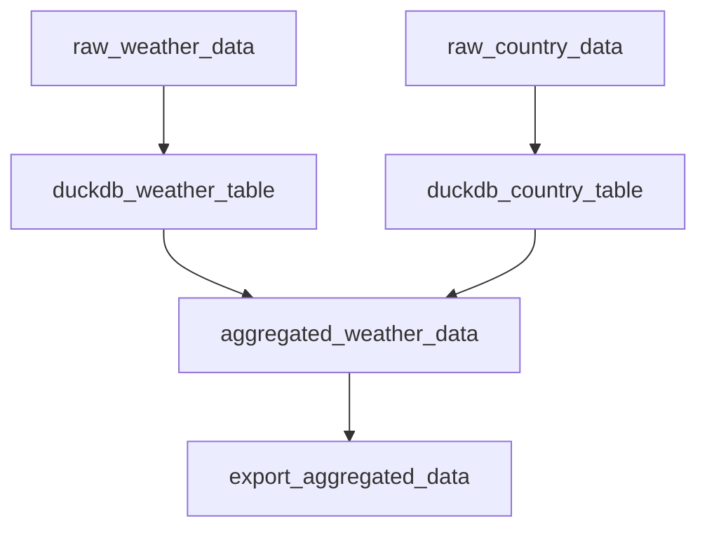

# Weather Analysis Tutorial (Introductory)

In this tutorial, we'll build a data pipeline using Dagster ODP to analyze weather data across different countries for January 2024. 

!!!tip "New to Dagster?"
    This tutorial assumes familiarity with Dagster concepts. If you're new to Dagster, we recommend checking out the [Dagster Quickstart](https://docs.dagster.io/getting-started/quickstart) and [Dagster Tutorial](https://docs.dagster.io/tutorial) first to get acquainted with the basics.

!!!info "Experienced Dagster Users"
    While this entire pipeline could be condensed into a single asset for efficiency, we've broken it down into multiple steps to better illustrate Dagster ODP concepts. Feel free to optimize the pipeline structure once you're comfortable with the workflow.

Before we dive into the details, let's take a look at the pipeline we're going to build:


This diagram shows the flow of data through our pipeline:

1. We start by downloading the raw weather data for January 2024 and the country data from the internet.
2. We then load this data into DuckDB tables. DuckDB is an embedded database, similar to SQLite, but optimized for analytical queries. It's a great choice for this pipeline because it's fast, requires no separate server setup, and works well with the kinds of aggregations we'll be doing.
3. Next, we join and aggregate the data using SQL queries within DuckDB.
4. Finally, we export the aggregated results to a CSV file.

By the end of this tutorial, you'll understand how to construct a Dagster ODP pipeline and be familiar with its key concepts.

## Prerequisites

- Dagster ODP installed (see [Quickstart Guide](../getting-started/quickstart.md))
- Basic familiarity with Dagster concepts

## Step 1: Set Up the Project

Let's create a new Dagster project using the scaffold command:

```bash
dagster project scaffold --name weather_analysis
cd weather_analysis
```
This command creates a basic Dagster project structure. We'll modify it to use Dagster ODP.

Now, let's create the necessary directories for our project:

```bash
mkdir -p odp_config/workflows
mkdir data
```
The `odp_config` directory will contain our Dagster ODP configuration, the `workflows` subdirectory will hold our pipeline definitions, and the `data` directory will store our input and output files.

## Step 2: Configure Dagster ODP Resources

Create a file `odp_config/dagster_config.yaml`:

```yaml title="dagster_config.yaml"
resources:
  - resource_kind: duckdb
    params:
      database_path: data/weather_analysis.db
```

This configuration defines the resources that Dagster ODP will create for our pipeline. In Dagster ODP, we define resources in the `dagster_config` file. This is different from standard Dagster, where resources are typically defined in Python code. This approach allows for easier configuration management and separates resource definitions from business logic.

Here's what this resource configuration does:

1. It specifies a `duckdb` resource, which is a pre-built ODP resource.
2. The `database_path` parameter tells DuckDB where to store the persistent database file.

Dagster ODP will convert this configuration into a Dagster resource that our assets can use.

## Step 3: Create a Custom Task

One of the powerful features of Dagster ODP is the ability to create custom tasks. Let's create a custom task to download files from a URL.

Create a new file `weather_analysis/tasks.py` with the following content:

```python title="tasks.py"
import requests
from dagster_odp.tasks.manager import BaseTask, odp_task

@odp_task("url_file_download")
class UrlFileDownload(BaseTask):
    source_url: str
    destination_file_path: str

    def run(self) -> dict:
        response = requests.get(self.source_url)
        response.raise_for_status()
        
        with open(self.destination_file_path, 'wb') as f:
            f.write(response.content)
        
        return {
            "file_size": len(response.content),
            "destination": self.destination_file_path
        }
```
This custom task does the following:

1. It uses the `@odp_task` decorator to register the task with Dagster ODP.
2. The task is a subclass of `BaseTask`, which is the base class for all ODP tasks.
3. It defines two parameters: `source_url` and `destination_file_path`.
4. The `run` method contains the logic to download the file and save it locally.
5. It returns a dictionary with metadata about the download, which will be available in the Dagster UI.

By creating this custom task, we're extending ODP's functionality to suit our specific needs.

## Step 4: Create the Workflow Configuration

Now, let's create our workflow configuration. Create a file `odp_config/workflows/weather_pipeline.yaml`:

```yaml title="weather_pipeline.yaml"
assets:
  - asset_key: raw_weather_data
    task_type: url_file_download
    description: "Download weather data from URL"
    group_name: data_ingestion
    params:
      source_url: https://storage.googleapis.com/odp-tutorial-weather-data/weather_2024_01.parquet
      destination_file_path: ./data/weather_2024_01.parquet

  - asset_key: raw_country_data
    task_type: url_file_download
    description: "Download country data from URL"
    group_name: data_ingestion
    params:
      source_url: https://storage.googleapis.com/odp-tutorial-weather-data/country_codes.csv
      destination_file_path: ./data/country_codes.csv

  - asset_key: duckdb_weather_table
    task_type: file_to_duckdb
    description: "Load weather data into DuckDB"
    group_name: data_loading
    depends_on: [raw_weather_data]
    params:
      source_file_uri: ./data/weather_2024_01.parquet
      destination_table_id: weather_data

  - asset_key: duckdb_country_table
    task_type: file_to_duckdb
    description: "Load country data into DuckDB"
    group_name: data_loading
    depends_on: [duckdb_weather_table, raw_country_data]
    params:
      source_file_uri: ./data/country_codes.csv
      destination_table_id: country_data

  - asset_key: aggregated_weather_data
    task_type: duckdb_query
    description: "Aggregate weather data by country"
    group_name: data_transformation
    depends_on: [duckdb_country_table]
    params:
      query: odp_config/aggregate_weather.sql
      is_file: true

  - asset_key: export_aggregated_data
    task_type: duckdb_table_to_file
    description: "Export aggregated data to CSV"
    group_name: data_export
    depends_on: [aggregated_weather_data]
    params:
      source_table_id: aggregate_weather_by_day
      destination_file_uri: ./data/aggregated_weather_data_2024_01.csv

jobs:
  - job_id: weather_analysis
    asset_selection: [raw_weather_data*, raw_country_data]
```
Note that we've placed this file in the workflows subdirectory within odp_config. This is the correct location for Dagster ODP to pick up workflow definitions.

Let's break down this configuration, looking at both the pipeline logic and the Dagster ODP concepts:

1. **Assets and Tasks**: In Dagster ODP, assets are defined using tasks. A task represents an action and produces Dagster assets. Each asset in this file corresponds to a Dagster asset, and the `task_type` field specifies which task to use. Note that we're using our custom `url_file_download` task for the first two assets.

2. **Pipeline Logic**:

  * **Data Ingestion**: The first two assets, `raw_weather_data` and `raw_country_data`, use our custom `url_file_download` task to fetch our raw data from URLs. This allows us to start with data stored online and bring it locally for processing.
  * **Data Loading**: Next, we load the downloaded files into DuckDB tables using the `file_to_duckdb` task. This prepares our data for efficient querying and aggregation.
  * **Data Transformation**: The `aggregated_weather_data` asset uses a SQL query (which we'll define next) to join and aggregate our data within DuckDB.
  * **Data Export**: Finally, we export our results to a Parquet file using the `duckdb_table_to_file` task.

3. **Group Name and Description**: The `group_name` and `description` fields are standard Dagster concepts that ODP passes through to the Dagster asset definitions. They help organize and document your assets.

4. **Dependencies**: The `depends_on` field defines dependencies between assets. These dependencies are passed directly into the Dagster asset definitions, ensuring that assets are materialized in the correct order.

5. **Jobs**: The `jobs` section defines a Dagster job. ODP converts this into a Dagster job definition, simplifying the process of creating jobs. Here, we define a single job that includes all of our assets.

This configuration creates a pipeline that downloads weather and country data, loads it into DuckDB, performs aggregations, and exports the results - with minimal Python code required for the pipeline itself.

Once you've completed all the setup steps and run your pipeline, you'll be able to see your job in the Dagster UI, looking something like this:


## Step 5: Create the SQL Query

Create a file `odp_config/aggregate_weather.sql` with the following content:

```sql title="aggregate_weather.sql"
CREATE OR REPLACE TABLE aggregate_weather_by_day AS
SELECT
    c.iso_2 AS country_code_2,
    c.country_name,
    w.obs_datetime,
    AVG(w.tmax_celsius) AS avg_tmax_celsius,
    AVG(w.tmin_celsius) AS avg_tmin_celsius,
    AVG(w.tavg_celsius) AS avg_tavg_celsius,
    SUM(w.precipitation_mm) AS total_precipitation_mm,
    SUM(w.snowfall_mm) AS total_snowfall_mm,
    COUNT(DISTINCT w.station_id) AS station_count
FROM weather_data w
LEFT JOIN country_data c ON w.country_code = c.fips_10_4
GROUP BY c.iso_2, c.country_name, w.obs_datetime;
```

This query joins our weather and country data and calculates various aggregations.

## Step 6: Update the Dagster Definitions

Replace the contents of `weather_analysis/definitions.py` with:

```python
from dagster_odp import build_definitions
from .tasks import UrlFileDownload  # Import our custom task

defs = build_definitions("odp_config")
```

This tells Dagster ODP to use our configuration files in the odp_config directory to build the dagster definitions. It also imports our custom task, ensuring it's available for use in our pipeline. Dagster ODP will convert our YAML configurations into the corresponding Dagster components (assets, resources, and jobs).

## Step 7: Run the Pipeline

Now you can run the pipeline using the Dagster CLI:

```bash
dagster dev
```

Open your browser and navigate to `http://localhost:3000`. You should see your Dagster instance with the `weather_analysis` job.

To execute the pipeline:

1. Click on the "Jobs" tab in the left sidebar.
2. Find the `weather_analysis` job and click on it.
3. Click the "Materialize all" button in the top right corner.

You can monitor the progress of your job in the Dagster UI. If you encounter any errors, check the Dagster logs in the UI for detailed information. The logs will often point you directly to the source of the problem.

Once the pipeline has finished running, you can find the aggregated CSV file (`aggregated_weather_data_2024_01.csv`) in your `data` directory. This file contains the summarized weather data for January 2024, grouped by country and date.

## Conclusion

Congratulations! You've built a real-world data pipeline using Dagster ODP. This tutorial demonstrated how to:

1. Define resources in the `dagster_config.yaml` file, separating infrastructure concerns from pipeline logic.
2. Create a workflow using various ODP task types in the `weather_pipeline.yaml` file, showcasing the power of configuration-driven development.
3. Understand how ODP tasks translate to Dagster assets, simplifying the creation of complex data flows.
4. See how Dagster ODP converts YAML configurations into Dagster components, reducing the amount of boilerplate code you need to write.

## Next Steps

- Try the [Chess Data Analysis Tutorial](../tutorials/chess_part_1.md) for a more advanced example using DLT, DBT, and Soda
- Explore core concepts in depth:
  - [Tasks and Assets](../concepts/tasks_and_assets.md) for building custom pipeline components
  - [Resources](../concepts/resources.md) for managing external connections
  - [Automation](../concepts/automation.md) for scheduling and event-driven pipelines
- Learn about ODP's integrations with [DLT](../integrations/dlt.md), [DBT](../integrations/dbt.md), and [Soda](../integrations/soda.md)
